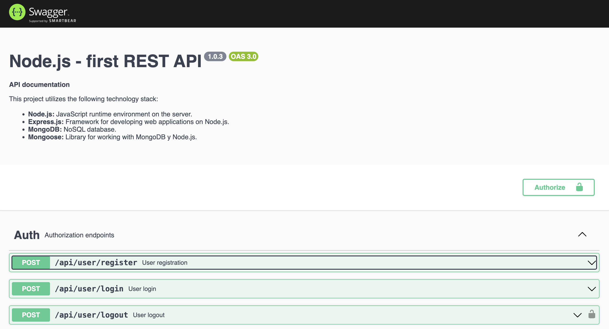

# Table of content

- [Postman](#Postman)
  - [Routes "user"](#routes-"user")  
  - [Routes "contact"](#routes-"contact")
- [Swagger documentation](#swagger-documentation)

## Ukrainian Version

For the document in Ukrainian, visit: [README.ua.md](README.ua.md)

# Postman

To test the REST API, use the following routes:

## Routes "user"

### POST http://localhost:3000/api/user/register

Receives a body in the format {email, password, subscription} (the first two fields are required, all fields must be strings, validation is present). 
`Response` :

If validation fails, returns "Error from Joi or another validation library" with status 400.

If the email is already in use, returns {"message": "Email in use"} with status 409.

If the body is valid, returns an object in the following format:

{
  "user": {
    "email": "example@example.com",
    "subscription": "starter"
  }
}

with status 201.

The subscription field is assigned a default value if not specified (starter, pro, business).

### POST http://localhost:3000/api/user/login

Receives a body in the format {email, password} (both fields are required and must be strings, validation is present). 
`Response` :

If validation fails, returns "Error from Joi or another validation library" with status 400.

If the email or password is incorrect, returns {"message": "Email or password is wrong"} with status 401.

If authentication is successful, a token is created and returned along with the user object:

{
  "token": "exampletoken",
  "user": {
    "email": "example@example.com",
    "subscription": "starter"
  }
}

with status 200.

### POST http://localhost:3000/api/user/logout

Requires an empty body with the Authorization header: Bearer {{token}}.
`Response` :

If the user does not exist in the "user" model by _id, returns {"message": "Not authorized"} with status 401.

Otherwise, the token is removed from the user and status 204 is returned.

### GET http://localhost:3000/api/user/current

Requires the Authorization header: Bearer {{token}}.
`Response` :

If the user does not exist, returns {"message": "Not authorized"} with status 401.

Otherwise, returns:

{
  "email": "example@example.com",
  "subscription": "starter"
}

with status 200.

### Commands:

npm start — Start the server in production mode.

npm run start:dev — Start the server in development mode.

npm run lint — Run ESLint to check code before each PR, fix all linting issues.

npm run lint:fix — Run ESLint with auto-fixes for simple errors.

## Routes "contact"

### GET http://localhost:3000/api/contact

`Response` : Returns an array of all contacts in JSON format with status 200.

### GET http://localhost:3000/api/contact/:id

`Response` :

If the ID exists, returns the contact object in JSON format with status 200.

If the ID does not exist, returns {"message": "not found"} with status 404.

### POST http://localhost:3000/api/contact

Receives a body in the format {name, email, phone} (all fields are required and must be strings).
`Response` :

If any required fields are missing or not strings, returns {"message": "missing required field(s) / non-string field(s)"} with status 400.

If valid, adds a unique identifier and returns:

{
  "id": "unique-id",
  "name": "John Doe",
  "email": "john@example.com",
  "phone": "123456789"
}

with status 201.

### DELETE http://localhost:3000/api/contact/:id

`Response` :

If the ID exists, returns {"message": "contact deleted"} with status 200.

If the ID does not exist, returns {"message": "not found"} with status 404.

### PUT http://localhost:3000/api/contact/:id

Receives a JSON body to update any of the fields name, email, or phone (validation is the same as when adding a contact).
`Response` :

If valid, returns the updated contact object with status 200.

Otherwise, returns {"message": "not found"} with status 404.

### PATCH http://localhost:3000/api/contact/:id/favorite

Receives a JSON body to update the favorite field (must be a boolean).
`Response` :

If favorite is missing or not a boolean, returns {"message":"missing field favorite"} with status 400.

If valid, returns the updated contact object with status 200.

Otherwise, returns {"message": "not found"} with status 404.

# Swagger documentation 
Link to documentation: 
https://contacts-backend-eikd.onrender.com/api-docs/

